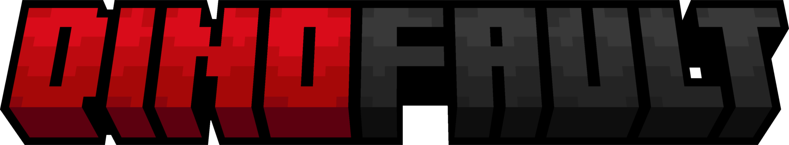

  

----------------------

A minecraft java resource pack with the goal of making the game beautiful to my tastes in almost every way possible  
Includes the full pack in various "modules" you can download separately

# Disclaimer(s)
This is resource pack is like a "mashup pack", as alot of assets were inspired or taken from other resource packs made by amazing people.  
please check out [credits.md](Credits.md) to support their work, since without them, this pack would look much worse!  

I will not be supporting or handling any issues with using the pack,  
this is a personal resource pack and I didn't make this with other peoples preferences in mind  

This resource pack is supposed to be used with **Minecraft Java Edition** 1.21.5+, and will likely never be ported to **Bedrock Edition** or anything before 1.21.x  

Some features of these resource packs require the use of specific mods, as listed below.  

 
<h3>Dependences<h3>
  

- Continuity
- Polytone
  
**These packs are incompatible with Optifine**

 
<h3>Mods Supported<h3>
  

- Mod Menu
- Simple Voice Chat
- Firehud

# FAQ

## Will you add support for `this` mod?  
Unless I personally use the mod you've suggested, no  

## Will you support Fresh Animations or PBR Shading?
It'll probably happen once the pack is 'finished', but for now it's unsupported

## Can I make my own overlay pack to add support for these missing features?
Yeah! I'd love to have people contribute to this and help expand support for mods that I don't use myself  
and please do share your pack so I can add it to the 'third party addons' list 

## Can I use your pack in a modpack?
Sure! Just give credit where you can and a link to the original place you found it  
(The only official places this is hosted are on Modrinth & Github under "The Dino King"; anywhere else has likely been reuploaded without my permission unless otherwise stated)

## Can I use some of your resources in my own resource pack?
Perfectly fine if it's for personal use!  
If you're planning to upload it on the other hand, please make sure to credit me somewhere, and check the credits document aswell (since not everything is made by me!)

